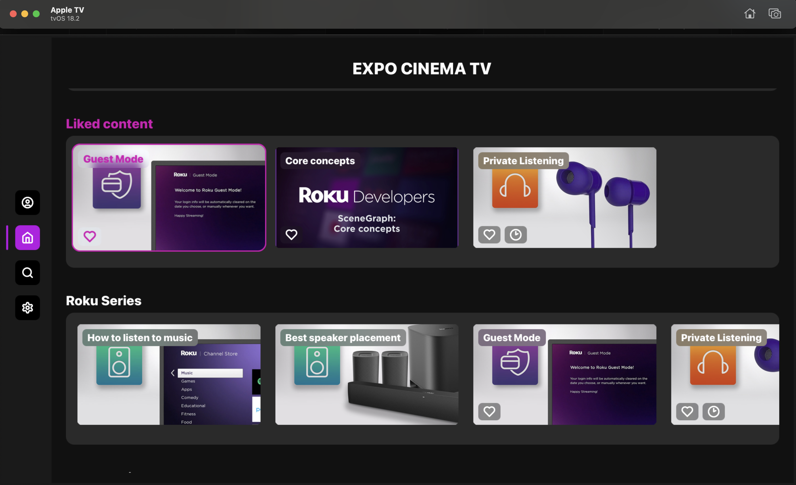
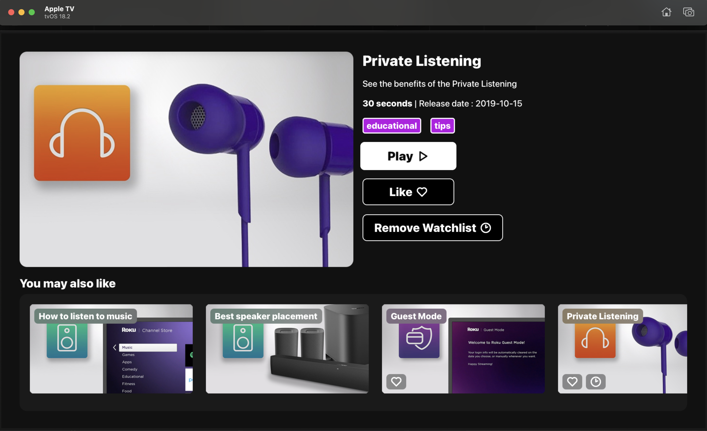
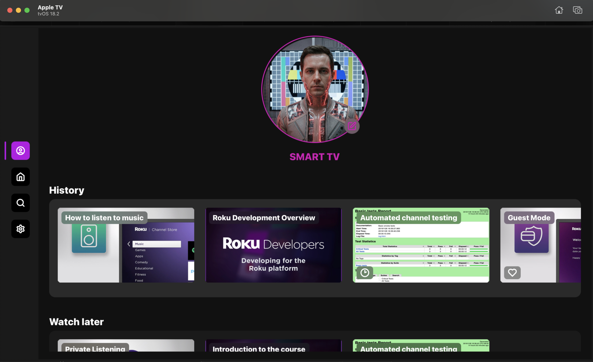

# Expo Cinema TV App

A TV application built for browsing and playing content on Apple TV (tvOS) and Android TV. The app is fully remote-driven, allowing users to navigate between screens, select content, and play videos using standard TV remote controls (Up, Down, Left, Right, Enter, Back).

---

## 📱 Screenshots

| Home Feed | Interstitial | Profile |
| :---: | :---: | :---: |
|  |  |  |
| Content carousels and sidebar navigation | Details view with Like, Watch later and Play | Avatar, history and personal lists |

---

## 🚀 Features

* **Content Browsing:** Horizontal carousels on the Home and Search screens to discover content.
* **Watch Later & Liked Lists:** Add or remove content from your personal lists. Persisted in storage and accessible via the Home and Profile screens.
* **Watch History:** Automatically saves the last 10 played items (without duplicates) when opening the player. Viewable on the Profile screen.
* **Search:** Virtualized grid with filtering capabilities by title or description.
* **User Profiles:** Choose from a list of preset avatars. Displays the selected avatar and name (falls back to "Unknown" if not set).
* **Localization (EN / RU):** Full support for English and Russian. Preferences are saved in storage. Defaults to the saved choice or device language on startup.
* **Remote Control Support:** Built-in focus management using LRUD (Left, Right, Up, Down) spatial navigation. Features an expandable sidebar menu on focus.

---

## 🛠 Tech Stack

* **Core:** React 19, TypeScript
* **Framework:** Expo SDK 54 + `react-native-tvos` (TV builds)
* **Navigation:** React Navigation (Bottom tabs for the custom sidebar menu + Native stack)
* **State Management:** Zustand (search, avatar, watchlist, likedlist, history)
* **Storage:** AsyncStorage (persistence for lists, avatar, language)
* **Localization:** i18next / react-i18next
* **Styling:** Emotion (styled-components, theming)
* **TV Navigation:** `react-tv-space-navigation` (focus and remote navigation)
* **Media & UI:** `expo-video` (video playback), `react-native-fast-image` (image caching for avatars and posters), `lucide-react-native` (icons)

---

## 📦 Data Persistence & Hydration

The app uses `AsyncStorage` to persist user data locally. On app start, the following data is hydrated from storage directly into the Zustand store:

* `watchlist` — Items marked as "Watch later"
* `likedlist` — Items marked as "Liked"
* `history` — Last 10 played items (stored by ID)
* `avatar` — Selected user avatar
* `lang` — Selected language (`en` or `ru`)

---

## 🖥 Screens & Navigation

The app is structured with a root Tab navigator (acting as a sidebar) and a Stack navigator on top for overlay screens.

### Tab Navigation (Sidebar)
The sidebar expands to show labels when focused.

| Screen | Description |
| :--- | :--- |
| **Home** | Hero section ("Expo Cinema TV") and horizontal carousels: Shorts Roku, Watch later, Liked content, Roku Series, Roku Movies. Combines mock data with personal lists. |
| **Search** | Search field with a virtualized result grid. Filters by title/description. Selecting a card opens the Interstitial screen. |
| **Profile** | Displays user avatar and name. Includes an "Edit" button to change the avatar. Features carousels for: History, Watch later, and Liked content. |
| **Settings** | Language switch (English / Russian). The choice is saved to storage and applied app-wide. |

### Stack Navigation

| Screen | Description |
| :--- | :--- |
| **Interstitial** | Content details view: Poster, title, description, release date, genres. Actions include Like, Watch later, play (opens Player), and a "You may also like" section. |
| **Player** | Video playback screen using `expo-video`. Includes play/pause, progress, and volume controls. Opening this screen adds the item to the watch history. |
| **EditAvatar** | Horizontal avatar carousel allowing users to pick a preset avatar. The selection is saved to storage and navigates back to the Profile. |

---

## 🏗 Project Structure

```text
src/
├── config/              # Remote control configuration (configureRemoteControl)
├── constants/           # Menu items, predefined avatars, mock content data
├── context/             # React Contexts (LanguageProvider, MenuProvider)
├── features/
│   └── video-player/    # Player UI, controls, watchlist/likedlist store, utils
│       ├── store/
│       ├── ui/
│       └── utils/
├── i18n/                # i18next configuration, locales (en, ru)
│   └── locales/
├── lib/
│   └── storage/         # AsyncStorage wrapper, storage keys schema
├── navigation/          # React Navigation setup (RootStack, RootTab)
├── providers/           # AppProvider (theme setup, hydration, i18n initialization)
├── screens/             # Screen components (Home, Search, Profile, Settings, etc.)
├── store/               # Zustand stores (search, avatar, historylist)
├── styles/              # Emotion Theme (colors, typography, spacing, sizes), templates
├── types/               # TypeScript definitions (TMovie, TAvatar, etc.)
├── utils/               # Helper functions (scaledPixels, getDeviceLang, etc.)
├── components/
│   ├── navigation/      # Navigation UI (Menu, SpatialRow, GoBack)
│   ├── screens/         # Screen-specific UI (ProfileImage, Interstitial elements, etc.)
│   └── shared/          # Reusable UI components (Typography, Buttons, Focusable components)
└── hooks/               # Custom hooks (useLanguageContext, PanEvent / RemoteControl)
```
## 🚀 Running the App

To run the application locally, use the following commands:

**For Apple TV (tvOS):**

```bash
# Choose a simulator from the list when prompted
npm run ios
```

**For Android TV:**

```bash
# Ensure an emulator/device is running and selected
npm run android
```

---

## ⚙️ Useful Commands

* `npm run typecheck` — Run TypeScript compiler checks.
* `npm run prebuild` or `npm run prebuild:tv` — Generate native prebuilds when native code changes are required.

